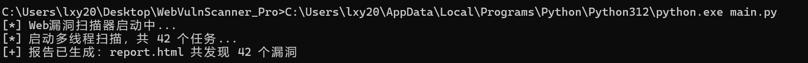
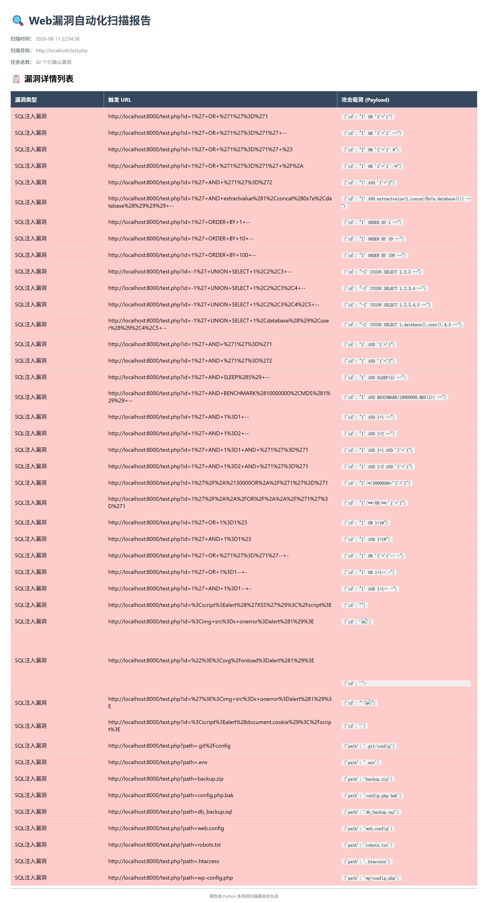

# 🕵️ WebVulnScanner - 考研复试项目

> 一个基于 Python 的多线程轻量级 Web 漏洞扫描器，支持 SQL 注入、XSS 检测，并自动生成 HTML 报告。

## 📖 项目简介
本项目是作者为计算机专业考研复试准备的开发项目。它利用 Python 的 `requests` 库和 `concurrent.futures` 多线程池，实现了对 Web 应用的自动化漏洞探测，并生成直观的网页报告。

## ✨ 核心功能亮点
- **🚀 多线程并发扫描**：内置线程池，可同时发送多个探测请求，极大提高扫描效率。
- **🛡️ 多漏洞检测引擎**：内置 SQL 注入、XSS（跨站脚本）等常见漏洞的 Payload 探测逻辑。
- **📊 自动化 HTML 报告**：扫描完成后，自动生成美观、易读的 HTML 网页报告，包含漏洞类型、触发 URL 及攻击载荷。
- **🧩 模块化架构**：代码采用 `main.py`（调度）、`core.py`（核心引擎）、`report.py`（报告生成）分层设计，易于扩展和维护。

## 🛠️ 主要技术栈
- **开发语言**：Python 3.8+
- **核心库**：`requests` (HTTP客户端), `concurrent.futures` (多线程并发)
- **报告格式**：HTML (原生文件写入)

## 🚀 如何运行
1. 确保本地或目标服务器有提供测试的 Web 环境（如 `test.php` 或 DVWA 靶场）。
2. 打开终端，进入项目根目录。
3. 运行主程序：
   ```bash
   python3 main.py
4.扫描完成后，项目目录下会自动生成report.html，双击即可用浏览器查看结果。

## 📷 运行效果展示
### 终端运行结果：

### 生成的可视化报告：


## 📂 项目结构
```text
WebVulnScanner_Pro/
├── main.py           # 主入口程序
├── core.py           # 核心扫描引擎
├── report.py         # HTML 报告生成器
└── README.md         # 项目说明文档
```

> **⚠️ 免责声明**  
> 本项目仅供网络安全学习与研究使用。用户在使用本工具时，必须确保目标测试已获得授权，严禁用于非法攻击或未经授权的扫描。由此产生的法律责任与开发者无关。